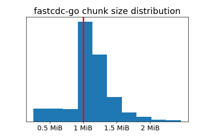
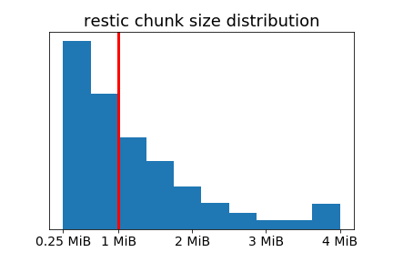

# FastCDC-Go

[](https://pkg.go.dev/github.com/jotfs/fastcdc-go?tab=doc) [](https://travis-ci.org/jotfs/fastcdc-go) [](https://codecov.io/gh/jotfs/fastcdc-go) [](https://goreportcard.com/report/github.com/jotfs/fastcdc-go)

FastCDC-Go is a Go library implementing the [FastCDC](#references) content-defined chunking algorithm.

Install: 
```
go get -u github.com/jotfs/fastcdc-go
```

## Example

```go
import (
  "bytes"
  "fmt"
  "log"
  "math/rand"
  "io"

  "github.com/jotfs/fastcdc-go"
)

opts := fastcdc.Options{
  MinSize:     256 * 1024
  AverageSize: 1 * 1024 * 1024
  MaxSize:     4 * 1024 * 1024
}

data := make([]byte, 10 * 1024 * 1024)
rand.Read(data)
chunker, _ := fastcdc.NewChunker(bytes.NewReader(data), opts)

for {
  chunk, err := chunker.Next()
  if err == io.EOF {
    break
  }
  if err != nil {
    log.Fatal(err)
  }

  fmt.Printf("%x  %d\n", chunk.Data[:10], chunk.Length)
}
```

## Command line tool

This package also includes a useful CLI for testing the chunking output. Install it by running:

```
go install ./cmd/fastcdc
```

Example:
```bash
# Outputs the position and size of each chunk to stdout 
fastcdc -csv -file random.txt
```

## Performance

FastCDC-Go is fast. Chunking speed on an Intel i5 7200U is >1GiB/s. Compared to [`restic/chunker`](https://github.com/restic/chunker), another CDC library for Go, it's about 2.9 times faster.

Benchmark ([code](https://gist.github.com/eadanfahey/ce2ba2733028e2b3b62a479ba2b9f62a)):
```
BenchmarkRestic-4     23384482467 ns/op	 448.41 MB/s	 8943320 B/op   15 allocs/op
BenchmarkFastCDC-4    8080957045 ns/op	1297.59 MB/s	16777336 B/op    3 allocs/op
```

## Normalization

A key feature of FastCDC is chunk size normalization. Normalization helps to improve the distribution of chunk sizes, increasing the number of chunks close to the target average size and reducing the number of chunks clipped by the maximum chunk size, as compared to the [Rabin-based](https://en.wikipedia.org/wiki/Rabin_fingerprint) chunking algorithm used in `restic/chunker`.

The histograms below show the chunk size distribution for `fastcdc-go` and `restic/chunker` on 1GiB of random data, each with average chunk size 1MiB, minimum chunk size 256 KiB and maximum chunk size 4MiB. The normalization level for `fastcdc-go` is set to 2.

 

Compared the `restic/chunker`, the distribution of `fastcdc-go` is less skewed (standard deviation 345KiB vs. 964KiB).

## License

FastCDC-Go is licensed unser the Apache 2.0 License. See [LICENSE](./LICENSE) for details.

## References

  - Xia, Wen, et al. "Fastcdc: a fast and efficient content-defined chunking approach for data deduplication." 2016 USENIX Annual Technical Conference
  [pdf](https://www.usenix.org/system/files/conference/atc16/atc16-paper-xia.pdf)

